# Profile

I'm dfbro, from SMK Telkom Malang.

I really love developing some apps or doing experiments of Cloud Infrastructure!

I've developed a portfolio web using Cloudflare Workers, Cloudflare D1 and NextJS.

I want to learn AWS VPC and Prisma ORM to solve web development problems.

     

     

---

